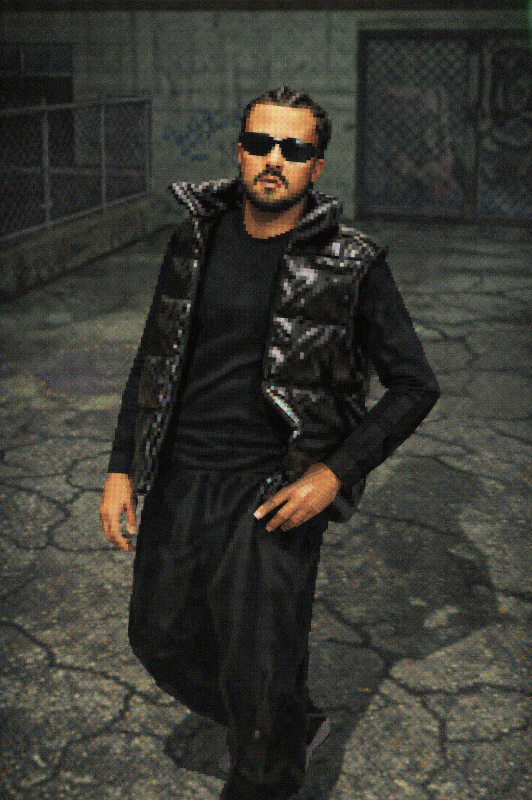

# morazcontato-morazcontato

  

  

---

# ⚡ Stack

 

---

# 📊 Stats

  

---

# 🏆 Trophies

---

# 📈 Activity Graph

---

<!-- MZ3D CHARACTER -->

  

---

## 🐍 Snake eating contributions

<picture>
  <source media="(prefers-color-scheme: dark)" srcset="https://raw.githubusercontent.com/morazcontato/morazcontato/output/github-contribution-grid-snake-dark.svg">
  <source media="(prefers-color-scheme: light)" srcset="https://raw.githubusercontent.com/morazcontato/morazcontato/output/github-contribution-grid-snake.svg">
  
</picture>

---

# 📌 Projetos em destaque

---

# 📸 Instagram · @morazzthecreative

  

<i>Founder · Developer · AI Builder</i>

---

# 🤝 Contato

